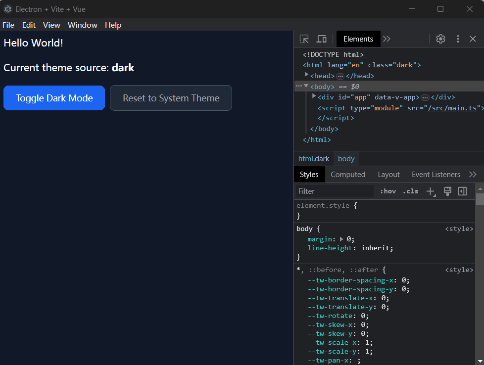

# electron-vite-vue

## Quick Setup

```sh
# clone the project
git clone https://github.com/bijinfeng/electron-vue-theme-switch.git

# enter the project directory
cd electron-vite-vue

# install dependency
npm install

# develop
npm run dev
```

## ScreenShot


